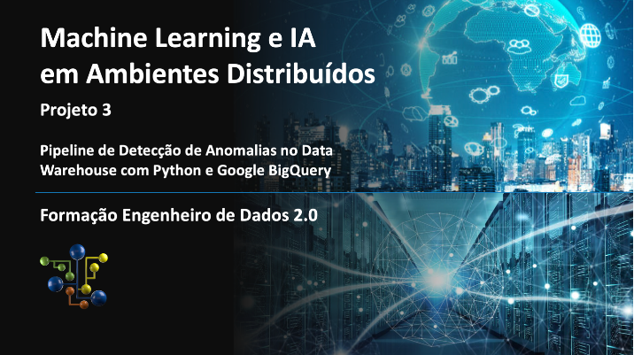
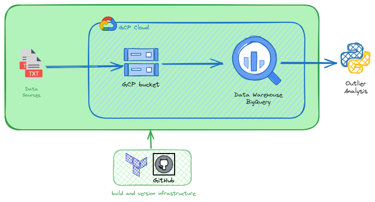
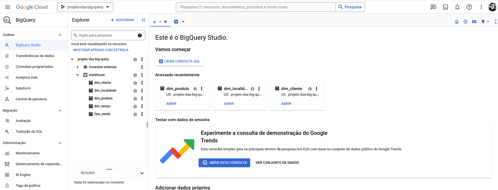
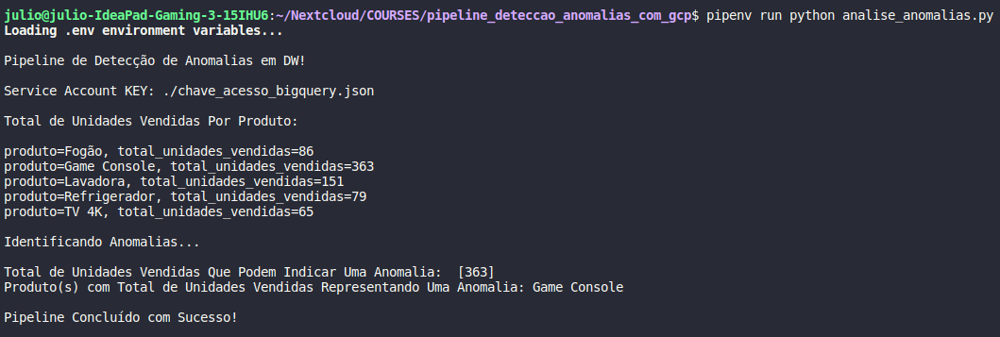

# Pipeline de Detecção de Anomalias no Data Warehouse com Python e Google BigQuery

> Fluxo automatizado para identificação de irregularidades no data warehouse, com o objetivo de preservar a integridade das operações de vendas, proporcionando uma compreensão aprimorada do desempenho dos produtos e promovendo a satisfação global do cliente.

Os dados, já tratados conforme o modelo definido para o Data Warehouse e no formato CSV, são armazenados na pasta `data`.

A partir da pasta data, os dados são enviados para um `bucket` na `Google Cloud Platform (GCP)` e adicionados ao Data Warehouse no `Google BigQuery`.

Utiliza-se o `Terraform` para a criação da infraestrutura e o upload dos dados.

Com a linguagem `Python`, desenvolve-se o código responsável por consumir os dados do Data Warehouse, realizar uma análise de outliers e retornar o resultado desejado.

## Arquitetura do Projeto



## Stack Tecnologica
[Python](https://www.python.org/)
[Terraform](https://www.terraform.io/)
[Google Big Query](https://cloud.google.com/bigquery)
[Google Cloud Storage](https://cloud.google.com/storage/)

## Como executar este projeto

1. Instale o terraform de acordo com seu sistema operacional.

2. Crie um novo projeto no GCP e uma conta de serviço que será utilizada pelo Terraform. Este [link](https://developer.hashicorp.com/terraform/tutorials/gcp-get-started/google-cloud-platform-build) nos guia para um tutorial onde criamos nossas credenciais e colocamos o arquivo `.json` na pasta infrastructure, lembre-se de alterar o nome do arquivo para `dsa-key.json.`

3. Caminhe até a pasta `infrastructure` e execute o comando terraform apply para criar a infraestrutura do projeto. O exemplo abaixo mostra como isso pode ser feito no ambiente Linux:
```bash
$ cd infrasctructure
$ terraform validade
$ terraform apply
```


4. Agora, no GCP, acesse suas contas de serviço e procure pela conta `dsajulioszeferino` e gere uma chave de acesso, assim como fizemos na conta de serviço que criamos para o Terraform.

5. Realize o download da chave e coloque na raiz do projeto com o nome chave_acesso_bigquery.json.

6. Instale as libs usando o pipenv ou outro gerenciador de pacotes a sua escolhe e execute o codigo do projeto.
```bash
$ pipenv run python analise_anomalias.py
```

> Para executar o projeto sem erros, ative as extensoes abaixo:
> https://console.cloud.google.com/apis/library/iam.googleapis.com?project=projeto-dsa-big-query
> https://console.cloud.google.com/apis/library/cloudresourcemanager.googleapis.com?project=projeto-dsa-big-query

## Exemplos de uso


## Histórico de Atualizações

*0.0.1
    * Projeto Inicial
